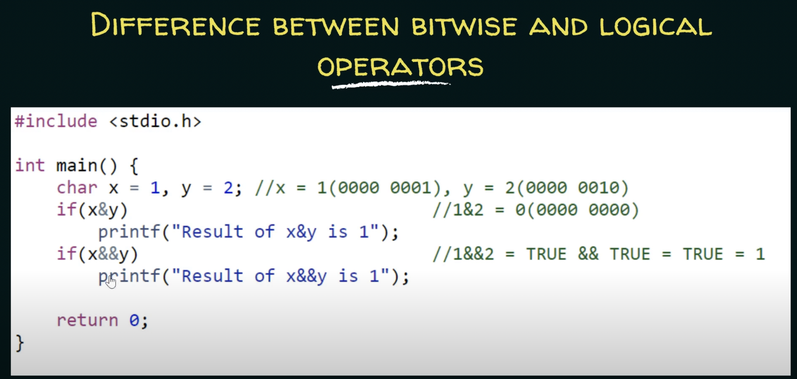

### Operators

Below is a diagram which describes various operators.

#### Left Shift (<<) Operators

    The left shift(<<) is a binary operator that takes two numbers, left shifts the bits of the first operand, and the second operand decides the number of places to shift. In other words, left-shifting an integer “a” with an integer “b” denoted as ‘(a<<b)’ is equivalent to multiplying a with 2^b (2 raised to power b).
	EX: a=21
	a << 1 = 42

#### Right Shift(>>)

    The Operator Right Shift(>
>) is a binary operator that takes two numbers, right shifts the bits of the first operand, and the second operand decides the number of places to shift. In other words, right-shifting an integer “a” with an integer “b” denoted as ‘(a>>b)‘ is equivalent to dividing a with 2^b.

	EX: a=21
        a >> 1 = 10

### Bitwise Operators

Example: Here x&y is bitwise operator and && is logical AND operator

