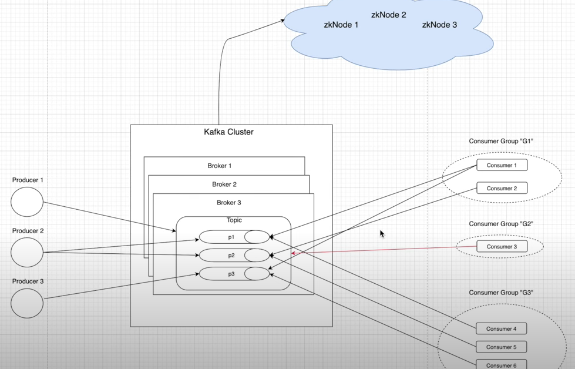
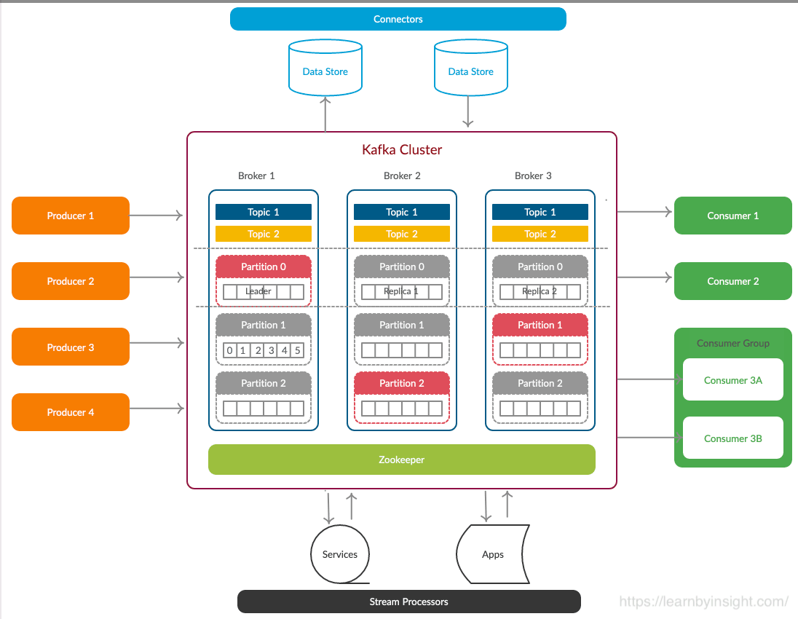

## GoLang
### What is Go
Go is a statically typed, compiled high-level, Open source programming language designed at Google

* Statically typed: Value types are defined in advance

* Compiled: Code is compiled ahead of execution

### Why Go
Go tries to combine the best of C++, Java & Python

* Easier syntax and faster compilation than C++

* Strict typing, as in Java and C++

* Better performance than Python

* Built-in core features and great support for third-party code

* Go is awesome for web services and apps

* There may be better alternatives for , Games, desktop apps etc..


## What is goroutine:
Goroutines are a further refinement of the concept of a thread. The refinement was
so remarkable that it became a separate entity called a “goroutine” instead of a thread. In a multi-processing environment, the creation, and maintenance of a process is heavily dependent on the underlying operating system. Processes consume operating system resources and do not share them among peers. Threads, although lighter than a process due to resource sharing among peer threads, need a large stack size – almost 1 MB in size. Therefore, N number of threads means N x 1 MB, which is considerably large.

Moreover, the switching of threads requires the restoration of registers, such as program counters, stack pointers, floating-point registers, and so forth. Because of this, the maintenance cost of a process or a thread is actually pretty high. Also, in cases where data is shared among peers, there is an overhead of synchronization for the data – not only in shared memory but also in different memory pools, like L1 cache, which helps when running tasks on multiple cores. Although the overhead switching between tasks has been improved a lot, creating new tasks still results in overhead. Due to this, they sometimes take a heavy toll on application performance, even though threads are designated as lightweight.

The advantage of goroutines is that they are not dependent on the underlying operating system; rather, they exist in the virtual space of the Go runtime. As a result, any optimization on a goroutine has a lower dependency on the platform it is running. Goroutines begin with the initial capacity of only a 2KB stack size, which is considerably low. Goroutines, along with channels, support communicating sequential process (CSP) models of concurrency, where values are passed between independent activities. These activities are – you may have guessed it – called goroutines. However, the variables, for the most part, are confined to a single activity.

## CSI

### Interfaces:
* Identity
* Controller
* Node


```
type IdentityServer interface {
  GetPluginInfo(context.Context, *csi.GetPluginInfoRequest) (*csi.GetPluginInfoResponse, error)
  GetPluginCapabilities(context.Context, *csi.GetPluginCapabilitiesRequest) (*csi.GetPluginCapabilitiesResponse, error)
  Probe(context.Context, *csi.ProbeRequest) (*csi.ProbeResponse, error)
}

```
```
type ControllerServer interface {
  CreateVolume(context.Context, *csi.CreateVolumeRequest) (*csi.CreateVolumeResponse, error)
  DeleteVolume(context.Context, *csi.DeleteVolumeRequest) (*csi.DeleteVolumeResponse, error)
  ControllerPublishVolume(context.Context, *csi.ControllerPublishVolumeRequest) (*csi.ControllerPublishVolumeResponse, error)
  ControllerUnpublishVolume(context.Context, *csi.ControllerUnpublishVolumeRequest) (*csi.ControllerUnpublishVolumeResponse, error)
  ValidateVolumeCapabilities(context.Context, *csi.ValidateVolumeCapabilitiesRequest) (*csi.ValidateVolumeCapabilitiesResponse, error)
  ListVolumes(context.Context, *csi.ListVolumesRequest) (*csi.ListVolumesResponse, error)
  GetCapacity(context.Context, *csi.GetCapacityRequest) (*csi.GetCapacityResponse, error)
  ControllerGetCapabilities(context.Context, *csi.ControllerGetCapabilitiesRequest) (*csi.ControllerGetCapabilitiesResponse, error)
}
```
```
type NodeServer interface {
  NodeStageVolume(context.Context, *NodeStageVolumeRequest) (*NodeStageVolumeResponse, error)
  NodeUnstageVolume(context.Context, *NodeUnstageVolumeRequest) (*NodeUnstageVolumeResponse, error)
  NodePublishVolume(context.Context, *NodePublishVolumeRequest) (*NodePublishVolumeResponse, error)
  NodeUnpublishVolume(context.Context, *NodeUnpublishVolumeRequest) (*NodeUnpublishVolumeResponse, error)
  NodeGetId(context.Context, *NodeGetIdRequest) (*NodeGetIdResponse, error)
  NodeGetCapabilities(context.Context, *NodeGetCapabilitiesRequest) (*NodeGetCapabilitiesResponse, error)
}
```

#### Summary:
1. attach/create symlink [controllerPublishVolume]
2. mount volume to a staging path(global directory on the node) [NodeStageVolume]
3. mount the volume from staging to target path(pod directory) [NodePublishVolume]


**ControllerPublishVolume**: This method is used make a volume available on some required node. For example, this would make an API call to the DigitalOcean Block Storage service to attach a created volume to a specified node.

**NodeStageVolume**: This method is called by the CO to temporarily mount the volume to a staging path. Usually this staging path is a global directory on the node. In Kubernetes, after it's mounted to the global directory, you mount it into the pod directory (via NodePublishVolume). The reason that mounting is a two step operation is because Kubernetes allows you to use a single volume by multiple pods. This is allowed when the storage system supports it (say NFS) or if all pods run on the same node. One thing to note is that you also need to format  the volume if it's not formatted already. Keep that in mind.

**NodeUnstageVolume**: This method is called by the CO to unmount the volume from the staging path. It's the reverse of NodeStageVolume

**NodePublishVolume**: This method is called to mount the volume from staging to target path. Usually what you do here is a bind mount. A bind mount allows you to mount a path to a different path (instead of mounting a device to a path). In Kubernetes, this allows us for example to use the mounted volume from the staging path (i.e global directory) to the target path (pod directory). Here, formatting is not needed because we already did it in NodeStageVolume.

Reference:
https://arslan.io/2018/06/21/how-to-write-a-container-storage-interface-csi-plugin

## Docker

#### DockerFile
```
# This is a sample Image
FROM ubuntu
MAINTAINER pravinranjan10@gmail.com #optional

RUN apt-get update
RUN apt-get install –y nginx
CMD [“echo”,”Image created”]
```

## Generic in golang
https://www.youtube.com/watch?v=WpTKqnfp5dY
* min goVersion: 1.18

* It is useful, when multiple data type can be used for same logc

#### without generic
```
package main

import "fmt"

func AddInt(a, b int) int {
	return a + b
}

func AddFloat(a, b float64) float64 {
	return a + b
}

func main() {
	fmt.Println(AddInt(2, 4))
	fmt.Println(AddFloat(2.5, 4.1))

}
```

#### with generic
Example 1

```
package main

import "fmt"

func Add[T int | float64](a, b T) T {
	return a + b
}

func main() {
	fmt.Println(Add(2, 4))
	fmt.Println(Add(2.5, 4.1))
}
```
Example 2

```
package main

import "fmt"

type Num interface {
	int | int8 | int32 | float64 | float32
}

func Add[T Num](a, b T) T {
	return a + b
}

func main() {
  fmt.Println(Add(2, 4))
  fmt.Println(Add(2.5, 4.1))
}
```
Example 3: contratins.Ordered supports all the data type(all version of signed, unsigned int, float, complex, string etc.)
```
package main

import (
  "fmt"
  "golang.org/x/exp/constraints"
  )

func Add[T constraints.Ordered](a, b T) T {
	return a + b
}

func main() {
	fmt.Println(Add(2, 4))
}
```
## Custom Controller

Reference:
1. https://smartkeyerror.com/Kubernetes-Informer
2. https://medium.com/speechmatics/how-to-write-kubernetes-custom-controllers-in-go-8014c4a04235

## Kafka vs RabbitMQ

## Kafka:
https://hevodata.com/learn/kafka-clusters/
### What is apache kafka:
* Kafka is Open source, distributed Message streaming platform that uses publish and subscriber mechanism to stream the records

* Originally developed by LinkedInd and later donated to apache foundation

* Kafka makes use of the Broker concept to duplicate and persist messages in a fault-tolerant manner while also separating them into subjects.

* Kafka is used for creating Real-Time Streaming Data Pipelines and Streaming Applications that convert and send data from its source to its destination.

### Key Features of Apache Kafka

* Low latency to deliver message to consumer (up to 10ms for large data)

* Seamless messaging functionality: Due to its unique ability to decouple messages and store them effectively, Kafka has the ability to publish, subscribe, and process data records in Real-Time.

* High Scalability, High Fault Tolerance

### Kafka Architecture

Architecture Image 1:



Architecture Image 2:




### What is Kafka Clusters?

A Kafka cluster is a system that consists of several Brokers, Topics, and Partitions for both. The key objective is to distribute workloads equally among replicas and Partitions. Kafka Clusters Architecture mainly consists of the following 5 components:

* Topics:

  A Kafka Topic is a Collection of Messages that belong to a given category or feed name.

  In Kafka, Topics are segmented into a customizable number of sections called Partitions. Kafka Partitions allow several users to read data from the same subject at the same time.

* Broker:

  The Kafka Server is known as Broker, which is in charge of the Topic’s Message Storage. Each of the Kafka Clusters comprises more than one Kafka Broker to maintain load balance. However, since they are stateless, ZooKeeper is used to preserve the Kafka Clusters state.

  It’s usually a good idea to consider Topic replication when constructing a Kafka system. As a result, if a Broker goes down, its Topics’ duplicates from another Broker can fix the situation.

  A Topic with a Kafka Replication Factor of 2 will have one additional copy in a separate Broker. Further, the replication factor cannot exceed the entire number of Brokers accessible.

* Zookeeper:

  The Consumer Clients’ details and Information about the Kafka Clusters are stored in a ZooKeeper. It acts like a Master Management Node where it is in charge of managing and maintaining the Brokers, Topics, and Partitions of the Kafka Clusters.

  The Zookeeper keeps track of the Brokers of the Kafka Clusters. It determines which Brokers have crashed and which Brokers have just been added to the Kafka Clusters, as well as their lifetime.
